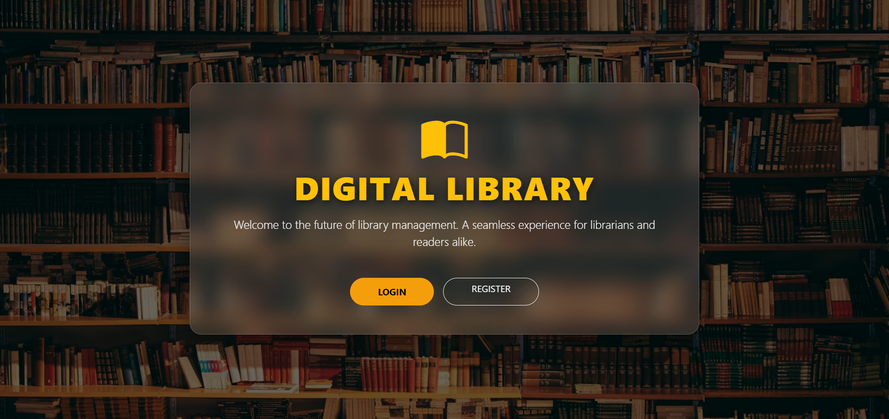
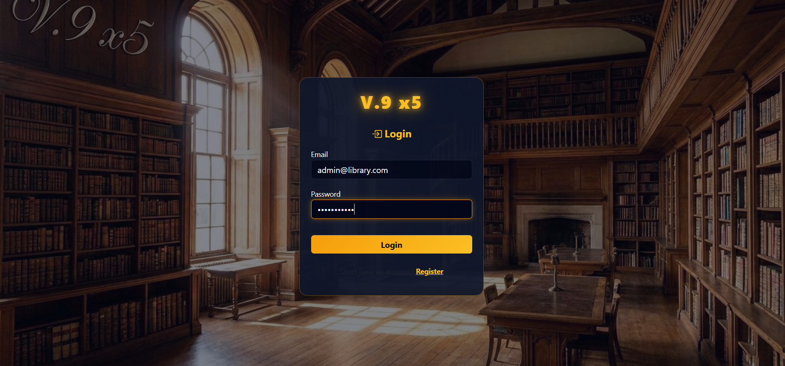
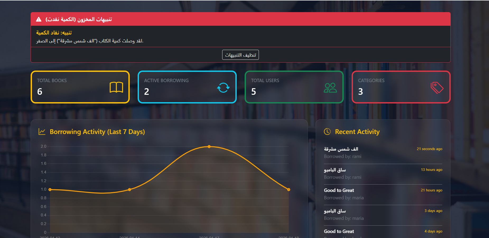
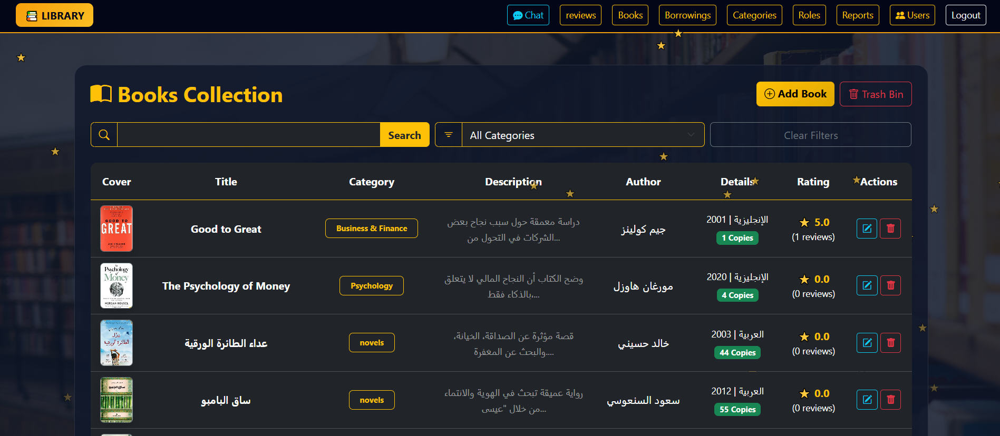
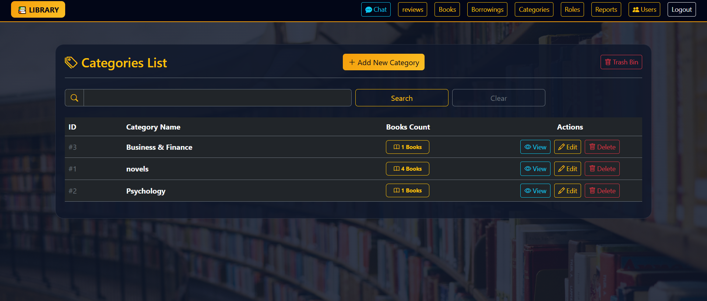
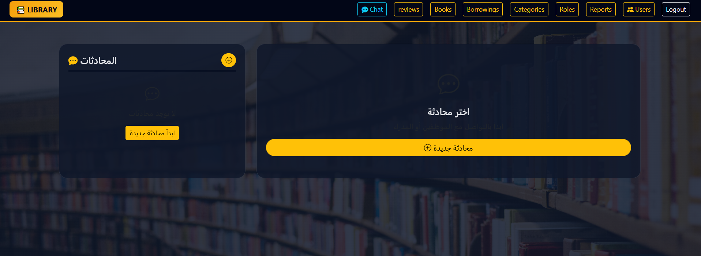
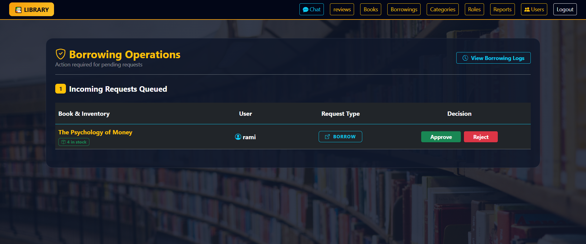
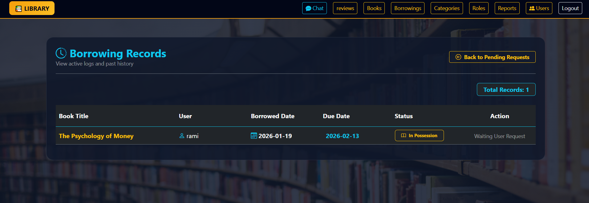
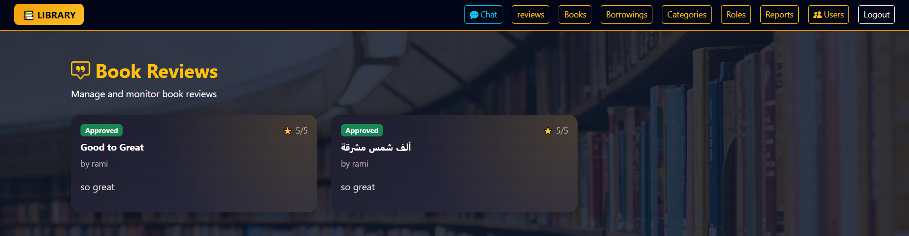

# 📚 Digital Library Management System
> The Digital Library Management System is a full-stack web application built to manage library operations in an organized and efficient way.  
The system supports both web (Blade) and API-based interactions, allowing administrators, employees, and subscribers to interact with the platform according to their roles and permissions

---


## 📸 Screenshots













</div>

# 📑 Table of Contents

* [📖 Project Overview](#-project-overview)
* [📸 Screenshots](#-screenshots)
* [⚙️ Requirements](#️-technical-requirements)
* [🛠️ Installation & Setup](#️getting-started-&-installation)
* [👥 System Roles](#-system-roles)
* [🗄️ Database Structure](#️-database-structure)
* [🔗 Interfaces & Routes](#-system-interfaces-&-routes)
* [📡 API Documentation](#-api-documentation-postman-guide)
* [📄 Sample Responses](#-sample-responses)
* [🔑 Sample Credentials](#-sample-credentials)
* [📞 Support & Contributions](#-support--contributions)
* [🏆 Acknowledgments](#-acknowledgments)
* [💻 Development Team](#-development-team)

---

## 📝 Project Overview
Digital Library Management System is a streamlined administrative dashboard and user interface designed to manage digital catalogs efficiently. The system provides an intuitive experience for browsing books by category, tracking loan requests, and managing user interactions through a robust rating and review system.

## 🚀 Key Features
* **📚 Book Management:** Centralized system to add, update, and organize digital books.
* **📂 Smart Categorization:** Filter and display content based on genres and categories.
* **🔄 Loan Tracking:** Automated workflow for borrowing books and monitoring return status.
* **⭐ Interaction & Feedback:** Integrated rating and review system for user engagement.
* **🖥️ User-Friendly Interface:** Simplified dashboard for both administrators and end-users.

---
## ⚙️ Technical Requirements
To run this project locally, ensure you have the following components installed:

| Component   | Version           |
|------------|-------------------|
| PHP        | ≥ 8.2             |
| Composer   | Latest            |
| Laravel    | 12.x              |
| Database   | MySQL / SQLite    |
| Node.js    | Latest (v18+)     |


---
## ⌨️ Getting Started & Installation
Follow these steps to set up the environment and launch the library system on your local machine:

### 1️⃣ Prepare the Source
First, clone the project and enter the directory:


```bash
git clone [https://github.com/RanadYousef/back_X5.git]
cd back_X5
```
## 2️⃣ Dependency Management
Install all required PHP and JavaScript packages:

```bash
composer install   # Installing backend packages
npm install        # Installing frontend assets
```

### 3️⃣ Environment Setup
Create your configuration file and generate a secure application key:

```bash
cp .env.example .env
php artisan key:generate
```
---

## 📧 Email Configuration (.env)
To enable email services (e.g., for support or notifications), configure your SMTP settings as follows:

| Key | Description | Example Value |
| :--- | :--- | :--- |
| `MAIL_MAILER` | Mail transfer protocol | `smtp` |
| `MAIL_HOST` | Outgoing mail server | `smtp.gmail.com` |
| `MAIL_PORT` | SMTP port | `587` |
| `MAIL_USERNAME` | Sender email address | `your-email@gmail.com` |
| `MAIL_PASSWORD` | Google App Password | `your-app-password` |
| `MAIL_FROM_ADDRESS` | Official sender email | `support@library.com` |
| `MAIL_SUPPORT_ADDRESS` | Technical support email | `help@library.com` |

> **💡 Security Tip:** For Gmail, you must enable **2-Step Verification** and generate an **App Password** from your Google Account security settings.

---

## 💬 Internal Chat System
The system includes a real-time messaging feature between Managers and Employees.

### 🗄️ Database Schema
| Table | Description | Key Fields |
| :--- | :--- | :--- |
| **Conversations** | Tracks chats between two users | `manager_id`, `employee_id`, `updated_at` |
| **Messages** | Stores individual messages | `conversation_id`, `sender_id`, `message`, `is_read` |


### 🏗️ Logic & Models
* **Models:** * `Conversation`: Manages user connections and message history.
    * `Message`: Handles individual message data and read status.
* **Relationships:** `Conversation` **hasMany** `Messages` | `Message` **belongsTo** `Conversation`.
* **Controller (`ChatController`):** * List all user conversations.
    * Initialize new chats.
    * Fetch message history.
    * Send/Save new messages and delete conversations.

---

### 4️⃣ Database Initialization
Build the library structure and populate it with initial data (Categories, Books, etc.):

```bash
php artisan migrate --seed
```

### 5️⃣ Launch the Platform
Start the development server and compile the assets:
**In your first terminal:**
```bash
php artisan serve
```
**In your second terminal:**
```bash
npm run dev
```

---

## 👥 System Roles

### 👑 System Administrator (Admin)
* **Authentication:** Secure login to the administrative panel.
* **Employee Management:** Full CRUD operations (Add, Update, Delete) for employee accounts.
* **Access Control:** Managing roles and system permissions.
* **Reporting:** Accessing and viewing detailed reports on book ratings and system performance.

### 👨‍💼 Library Employee
* **Inventory Management:** Adding new books with full details (Title, Author, Genre, Pages, Cover, and Description).
* **Categorization:** Organizing the library into genres (Novels, Science, History, Kids, etc.).
* **Content Control:** Updating or deleting book records as needed.
* **Operations:** Managing book borrowing requests and monitoring user reviews/ratings.

### 📖 Member (Subscriber)
* **Account Creation:** Registering with full name, email, and password.
* **Access:** Secure login to browse the digital library.
* **Browsing:** Exploring book collections filtered by categories.
* **Borrowing:** Functionality to request, borrow, and return books.
* **Engagement:** Rating books and submitting written reviews.

---


## 🗄️ Database Structure
The system follows a highly structured relational database schema to ensure data integrity and smooth library operations:

### 📁 Categories Table
Defines the genres or sections of the library.

* `id`: Primary key.
* `name`: The name of the category (e.g., Science, Novels).

### 📚 Books Table
Contains detailed information about each digital resource.

* `id`: Primary key.
* `category_id`: Foreign key linked to Categories.
* `title` / `author`: Basic book details.
* `description`: Full summary of the book content.
* `publish_year` / `language`: Publishing metadata.
* `copies_number`: Available stock for borrowing.
* `cover_image`: Path to the uploaded book cover.

### 🔄 Borrowings Table
Tracks the lifecycle of a book loan.

* `id`: Primary key.
* `user_id` / `book_id`: Foreign keys linking users and books.
* `borrowed_at`: Timestamp when the loan started.
* `returned_at`: Timestamp of actual return.
* `status`: Current state (`borrowed`, `returned`, `overdue`).

### ⭐ Reviews Table
Manages user feedback and quality control.

* `id`: Primary key.
* `user_id` / `book_id`: Foreign keys.
* `rating`: Numerical score (`1` `to` `5`).
* `comment`: Optional text feedback.
* `status`: Moderation status of the review.

---

## 🔗 System Interfaces & Routes
The management system is divided into two main dashboards to ensure a structured workflow:

###  👑 Administrator Interface

| Feature | URL Route | Description |
| :--- | :--- | :--- |
| **Admin Dashboard** | `/admin` | Overview of system-wide statistics and reports. |
| **Employee Management** | `/admin/employees` | Control center for managing employee accounts. |


### 👨‍💼 Employee Interface

| Feature | URL Route | Description |
| :--- | :--- | :--- |
| **Main Workspace** | `/employee/dashboard` | Quick access to daily library tasks. |
| **Inventory Control** | `/employee/books` | Full management of the book catalog. |
| **Loan Processing** | `/employee/borrowings` | Reviewing and approving borrowing requests. |


---
# 📡 API Documentation (Postman Guide)

This section details the available API endpoints and how to interact with them using tools like Postman.

---

## 🔐 1. Authentication Module
*All auth routes return a Bearer Token upon successful login/register.*


| Method | Endpoint | Postman Body (JSON) | Description |
| :--- | :--- | :--- | :--- |
| `POST` | `/api/register` | `name`, `email`, `password` | Create a new account |
| `POST` | `/api/login` | `email`, `password` | Get Access Token |
| `POST` | `/api/logout` | *(Requires Token)* | Revoke current session |


---

---

## 🚀 Postman API Guide (Borrowing System)
You can test the library core functionality using these endpoints. Make sure to include the `Bearer Token` in the header for protected routes.


### 📚 Book Catalog

| Method | Endpoint | Description |
| :--- | :--- | :--- |
| `GET` | `/api/books` | Retrieve all books with their details and categories. |


### 🔄 Borrowing Operations

| Method | Endpoint | Description |
| :--- | :--- | :--- |
| `POST` | `/api/borrowings/request-borrow` | Submit a new request to borrow a specific book. |
| `POST` | `/api/borrowings/request-return/{id}` | Notify the library that you are returning a book. |


### 📊 User Activity & History

| Method | Endpoint | Description |
| :--- | :--- | :--- |
| `GET` | `/api/borrowings/current` | View your currently active loans. |
| `GET` | `/api/borrowings/history` | View a full history of all your past and returned books. |


---

## 📄 Sample Responses

### 📚 Book Details Response:

```json

{
    "status": "success",
    "message": "Books retrieved successfully",
    "data": [
        {
            "id": 2,
            "title": "Good to Great",
            "author": "جيم كولينز",
            "description": "دراسة معمقة حول سبب نجاح بعض الشركات في التحول من أداء عادي إلى أداء استثنائي...",
            "publish_year": "2001",
            "language": "الإنجليزية",
            "copies_number": 1,
            "cover_image": "[http://127.0.0.1:8000/storage/books/covers/example.png](http://127.0.0.1:8000/storage/books/covers/example.png)",
            "category": {
                "id": 3,
                "name": "Business & Finance"
            },
            "borrows_count": 2,
            "average_rating": 3
        }
    ]
}
```


### 📚 Borrow Response:
```json
{
    "status": "success",
    "message": "Borrow request submitted successfully",
    "data": {
        "id": 10,
        "user_id": 5,
        "book_id": "5",
        "request_type": "borrow",
        "status": "pending",
        "created_at": "2026-01-17T18:18:21.000000Z",
        "updated_at": "2026-01-17T18:18:21.000000Z"
    }
}
```

## 🔑 Sample Credentials
You can use these accounts to explore the different dashboards and functionalities:


| Role | Email | Password |
| :--- | :--- | :--- |
| **👑 Admin** | `admin@library.com` | `password123` |
| **👨‍💼 Employee** | `employee@library.com` | `password123` |


---

## 📞 Support & Contributions
If you encounter any bugs or wish to improve the system:
* 🛠 **Report Issues:** Open an issue on the GitHub repository.
* 🌿 **Contribute:** Fork the project and submit a pull request.
* 💬 **Feedback:** Contact the team for suggestions or collaboration.

---

## 🏆 Acknowledgments

### 🌟 Special Thanks
**Focal X Agency** For their continuous commitment to empowering students and providing exceptional learning opportunities.

### 🎓 Mentors & Supervisors
A huge thank you to our mentors for their technical guidance and inspirational support:
* **Mr. Hashim Othman:** Technical guidance & concept clarification.
* **Mr. Ayham Ibrahim:** Constant support throughout the development phase.
* **Ms. Nourhan Almohammed & Ms. Muna Alrays:** Technical support and daily follow-up.

Special thanks to the **Focal X Team** and the CEO & Founder **Alaa Darwish** for building this educational journey.

---

## 💻 Development Team
The creative developers who brought this project to life:

| Role | Name |
| :--- | :--- |
| **Lead Developer** | Ranad Yousef |
| **Assistant Developer** | Mouhamad Deop |
| **Backend Developer** | Morhaf Asaeed |
| **Backend Developer** | Ali Mohammed |

---

<p align="center">
  <b>Thank you to all educators and mentors who made this project a reality. 📖✨</b>
</p>